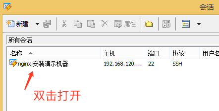

# nginx 配置mp4 播放

## 先决条件

1. 服务器操作系统是Centos 7
2. 用客户端工具连接 服务器, 连接方法之一可参考此文:`https://blog.csdn.net/ZZY1078689276/article/details/77280814`
3. 按下文操作
## 部署过程
### 服务器开机

```
正常开机
```

### 输入账号, 密码登录


#### 登录成功的样子


### 查看ip


找到自己能够用`工具` 连接的ip (内网或者公网)

### 使用SSH 工具(为了方便复制粘贴)

SSH 工具, 自行选择, 这里使用 xshell 做示范


1. 点击箭头所指的位置


2. 依次按上图填入自己的信息





3. 双击打开


4. 登录成功样子

### 优化打开文件限制

```
echo "* soft nofile 65535" >> /etc/security/limits.conf 
echo "* hard nofile 65535" >> /etc/security/limits.conf
```


### 关闭防火墙和`selinux`

```
systemctl stop firewalld
systemctl disable firewalld
setenforce 0
sed -i 's/SELINUX=enforcing/SELINUX=disabled/g' /etc/selinux/config
```


### 安装 `yum-utils`

```
# 此步骤需要确认服务器能够访问互联网, 并有有效的yum源, 默认是可以正常使用的
sudo yum install yum-utils -y
```


### 安装nginx稳定版官方源

```
cat > /etc/yum.repos.d/nginx.repo << "EOF"
[nginx-stable]
name=nginx stable repo
baseurl=http://nginx.org/packages/centos/$releasever/$basearch/
gpgcheck=1
enabled=1
gpgkey=https://nginx.org/keys/nginx_signing.key
module_hotfixes=true

[nginx-mainline]
name=nginx mainline repo
baseurl=http://nginx.org/packages/mainline/centos/$releasever/$basearch/
gpgcheck=1
enabled=0
gpgkey=https://nginx.org/keys/nginx_signing.key
module_hotfixes=true
EOF
```


### 安装nginx 

```
yum install -y nginx  # 这一步会比较慢, 只要不断就耐心等待
```


### nginx.conf 配置参考

```
\cp /etc/nginx/nginx.conf /etc/nginx/nginx.conf.baktest
cat > /etc/nginx/nginx.conf << "EOF"
user  nginx;
worker_processes  auto;

error_log  /var/log/nginx/error.log warn;
pid        /var/run/nginx.pid;


events {
    worker_connections  10240;
}


http {
    include       /etc/nginx/mime.types;
    default_type  application/octet-stream;

    log_format  main  '$remote_addr - $remote_user [$time_local] "$request" '
                      '$status $body_bytes_sent "$http_referer" '
                      '"$http_user_agent" "$http_x_forwarded_for"';

    access_log  /var/log/nginx/access.log  main;

    sendfile        on;
    #tcp_nopush     on;

    keepalive_timeout  65;

    #gzip  on;

    include /etc/nginx/conf.d/*.conf;
}
EOF
```


### 视频网站配置文件参考

```
\cp /etc/nginx/conf.d/default.conf /etc/nginx/conf.d/default.conf.baktest
cat > /etc/nginx/conf.d/default.conf << "EOF"
server {
    listen       80;
    server_name demo.videodrm.cn;
    
    location / {
        
        charset utf-8;   # 支持中文
        autoindex on;  # 开启自动索引
        root   /usr/share/nginx/html;
        index  index.html index.htm;
    }
    
    error_page   500 502 503 504  /50x.html;
    location = /50x.html {
        root   /usr/share/nginx/html;
    }
}
EOF
```


### 重启nginx

```
systemctl restart nginx
```


没有报错, 就可以继续下一步

#### 步骤解释

1. 将视频放入nginx 的 `root` 目录下,此示例为`/usr/share/nginx/html` 即可
2. 另外优化可以根据业务需要进行优化


### 删除`/usr/share/nginx/html`下的index文件

*** 此步骤出删除默认索引页, 所以确定自己没有网站*** 

 ```
rm -f /usr/share/nginx/html/index.html
 ```


### 在`/usr/share/nginx/html`创建视频目录

```
mkdir /usr/share/nginx/html/语文
mkdir /usr/share/nginx/html/数学
mkdir /usr/share/nginx/html/英语
```


### 上传视频到对应的目录, 例如上传视频到 语文目录下


1. xshell 中切换到 语文目录下
2. 在xshell 中直接调用xftp 程序, 如果软件版本号相同, 会自动切换到语文目录下


选中视频, 右键传输


传输成功


### 浏览器打开网址(ip), 例如:192.168.120.131


### 播放视频

选择刚刚上传到语文目录下的视频播放


